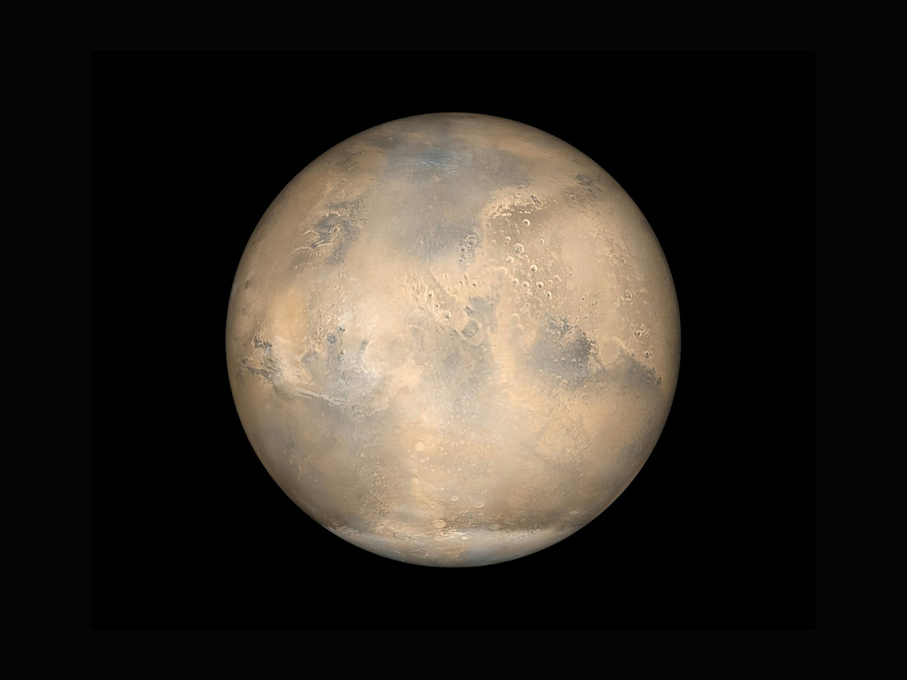

# 📸 Save Reference Image Instructions

## Quick Steps

To display the reference Starlink image in the notebook:

1. **Save the reference image** you provided to this directory as:
   ```
   starlink_reference_image.png
   ```

2. **Reload the notebook** in Jupyter to see the image at the beginning

## Alternative: Use Our Generated Image

You can also use the photorealistic visualization we just created:

```bash
cp starlink_photorealistic_earth.png starlink_reference_image.png
```

Then reload the notebook.

## What Was Added

A new markdown cell was inserted at position #1 with:

```markdown
# 🌍 Starlink 3D Quantum Optimization



*Professional visualization of the Starlink satellite constellation - our goal is to create similar photorealistic renders.*

---
```

## Verification

After saving the image, open the notebook and you should see:
- Cell 0: Title
- **Cell 1: Header with reference image** ← NEW!
- Cell 2: Setup and Installation
- Cell 3: Import Libraries
- ... (rest of the notebook)

---

**Note**: The notebook has been successfully modified. Just add the image file and reload!
